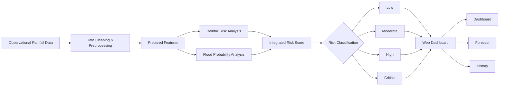
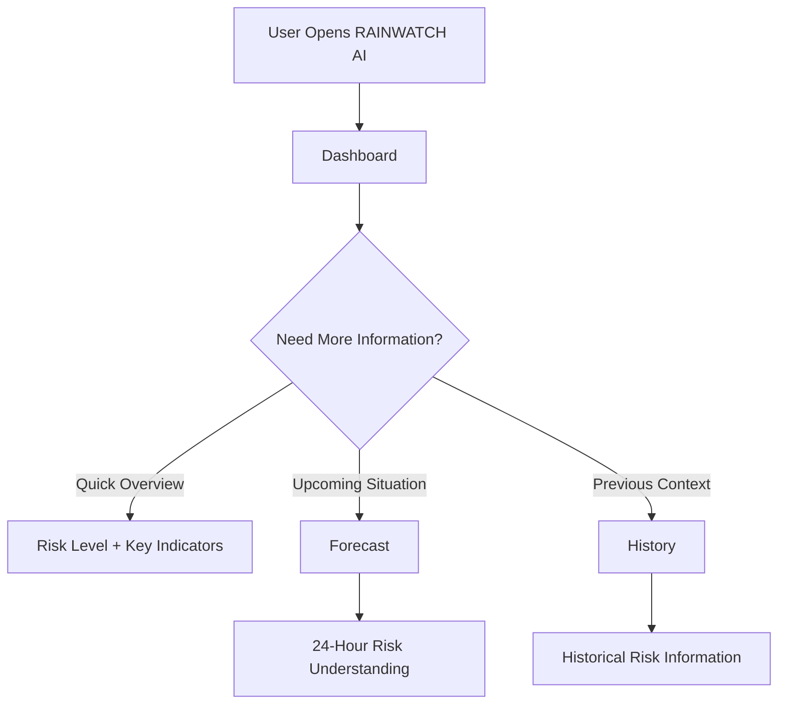
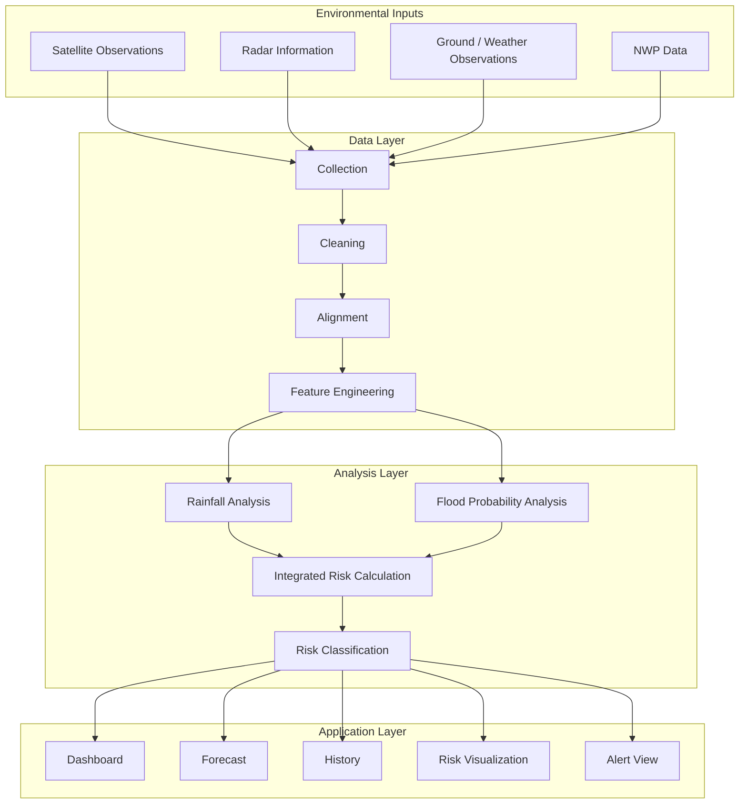
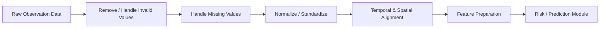
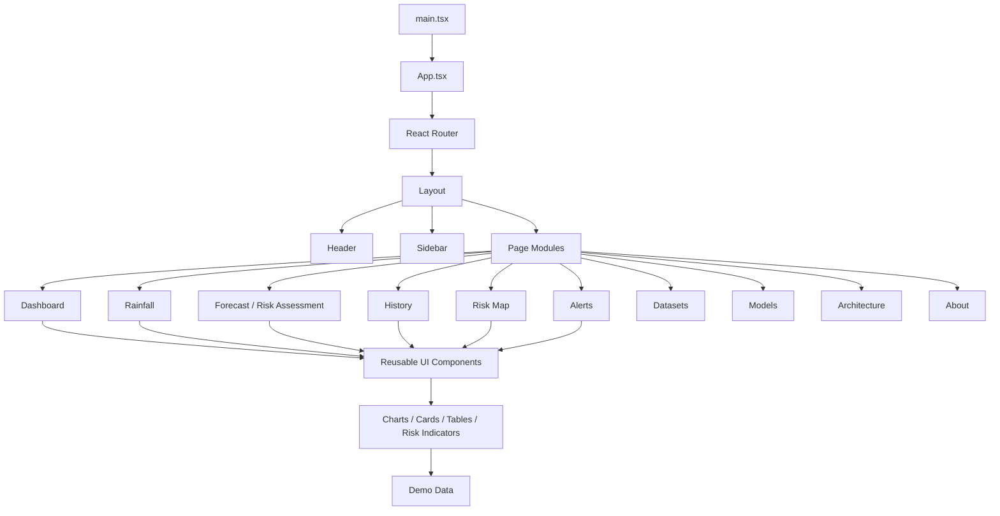

# 🌧️ RAINWATCH AI — SIH 2026 Prototype

### AI/ML-Assisted Heavy Rainfall Early Warning & Inundation Risk Assessment

**Team:** Syntax Squad  
**Event:** Smart India Hackathon (SIH) 2026  
**Institution:** Sister Nivedita University, West Bengal

> **Prototype status:** RAINWATCH AI is a demonstration and decision-support prototype. The current web interface uses prepared/deterministic demonstration data for evaluation. It is **not a live operational warning system** and its outputs must not be treated as official weather or emergency warnings.

---

## 📌 Table of Contents

- [About the Project](#-about-the-project)
- [Problem & Objective](#-problem--objective)
- [How the System Works](#-how-the-system-works)
- [User Flow](#-user-flow)
- [Core Features](#-core-features)
- [Risk Assessment Logic](#-risk-assessment-logic)
- [System Architecture](#-system-architecture)
- [Data Processing Pipeline](#-data-processing-pipeline)
- [Technology Stack](#-technology-stack)
- [Project Structure](#-project-structure)
- [Frontend Architecture](#-frontend-architecture)
- [Pages & Modules](#-pages--modules)
- [Demo Data](#-demo-data)
- [Run Locally](#-run-locally)
- [Production Build](#-production-build)
- [Limitations & Future Scope](#-limitations--future-scope)
- [Team](#-team)
- [Prototype Screenshots](#-prototype-screenshots)

---

## 🌍 About the Project

**RAINWATCH AI** is a web-based decision-support prototype designed to present heavy-rainfall conditions and potential inundation/flood risk in a simple and actionable format.

The system brings together rainfall information, flood probability, risk classification, forecasting views and historical information into a single dashboard. The objective is to reduce the effort required to interpret complex environmental information and make risk information easier to understand.

The prototype is designed around an observation-driven workflow and demonstrates how environmental data can be processed and transformed into user-facing **rainfall, flood-probability and integrated-risk indicators**.

---

## 🎯 Problem & Objective

Heavy rainfall can rapidly increase the possibility of waterlogging, inundation and flooding. Raw rainfall measurements alone may be difficult for a non-technical user to interpret.

RAINWATCH AI aims to provide a simple flow:

```text
Environmental / Rainfall Information
                ↓
        Data Preparation
                ↓
       Risk & Probability Analysis
                ↓
      Risk Classification / Forecast
                ↓
      Dashboard & Visual Information
                ↓
       Faster Risk Understanding
```

### Main objectives

- Monitor rainfall-related conditions.
- Estimate and display flood probability.
- Combine rainfall risk and flood probability into an integrated risk score.
- Classify conditions into understandable risk levels.
- Provide a 24-hour forecast-oriented view in the prototype.
- Preserve historical information for contextual understanding.
- Present complex information through a simple web interface.

---

## 🔄 How the System Works

The prototype follows a layered flow from data to user interface:



> **Important:** The diagram represents the intended analytical workflow. The current SIH prototype demonstrates the user interface with prepared demonstration values rather than a continuously connected live data pipeline.

---

## 👤 User Flow

The interface is designed around different levels of information need.



### Why this flow?

- **Dashboard:** for users who need a quick understanding.
- **Forecast:** for users who want to explore the upcoming 24-hour situation.
- **History:** for users who want additional context about previous conditions.

This keeps the first screen simple while still allowing deeper exploration.

---

## ✨ Core Features

### 📊 Dashboard

Provides a consolidated view of the main rainfall and flood-risk indicators.

- Rainfall information
- Flood probability
- Integrated risk score
- Risk classification
- Key visual indicators

### 🔮 Forecast

Provides a prototype view of the expected situation over the **next 24 hours**.

- Rainfall-related forecast information
- Risk-oriented forecast view
- Easy-to-read visual indicators

### 🕘 History

Provides previous risk information so users can understand how the situation has developed over time.

- Historical risk records
- Previous rainfall/risk context
- Chronological information for comparison

### 🗺️ Risk Visualization

The prototype also contains location-oriented risk visualization to make spatial risk information easier to interpret.

### 🚨 Alert View

The prototype contains an alert-oriented interface for highlighting important risk conditions. It is a **demonstration feature**, not a live emergency notification service.

### 🧠 Model / Architecture Views

Dedicated pages explain the proposed model concept, system architecture and the relationship between environmental inputs and risk outputs.

---

## 🧮 Risk Assessment Logic

For demonstration purposes, the prototype uses an integrated risk score:

$$
\text{Risk Score} = (\text{Rainfall Risk} \times 0.55) + (\text{Flood Probability} \times 0.45)
$$

### Risk Classification

| Risk Level | Score Range | Meaning in the Prototype |
|---|---:|---|
| 🟢 **Low** | 0.00 – 0.29 | Relatively lower estimated risk |
| 🟡 **Moderate** | 0.30 – 0.54 | Increased attention may be required |
| 🟠 **High** | 0.55 – 0.74 | Higher potential risk condition |
| 🔴 **Critical** | 0.75 – 1.00 | Highest demonstration risk category |

```text
                INTEGRATED RISK
                       │
          ┌────────────┴────────────┐
          │                         │
   Rainfall Risk 55%        Flood Probability 45%
          │                         │
          └────────────┬────────────┘
                       ↓
                 Risk Score
                       ↓
          ┌────────────┼────────────┐
          ↓            ↓            ↓
         Low       Moderate       High       Critical
```

> These weights and thresholds are **prototype demonstration parameters**. A real deployment would require statistical validation, calibration, uncertainty estimation and domain-expert approval.

---

## 🏗️ System Architecture



### Architecture layers

| Layer | Responsibility |
|---|---|
| **Input Layer** | Environmental and rainfall information |
| **Data Layer** | Cleaning, alignment and feature preparation |
| **Analysis Layer** | Rainfall analysis, flood probability and integrated risk |
| **Application Layer** | Dashboard, forecast, history and visual risk presentation |

---

## 🧹 Data Processing Pipeline

Data quality is important before any risk analysis. The proposed workflow is:



### Why preprocessing matters

Raw environmental data may contain missing values, inconsistent formats or observations that are not directly comparable. Cleaning and alignment help create a more consistent input for downstream analysis.

---

## 🧩 Technology Stack

### Frontend

| Technology | Purpose |
|---|---|
| **React 18** | Component-based user interface |
| **TypeScript** | Typed application development |
| **Vite** | Development server and build tooling |
| **React Router** | Page navigation |
| **Tailwind CSS** | Responsive styling |
| **Recharts** | Data visualization |
| **Lucide React** | Interface icons |

### System / ML Concept

The proposed architecture can integrate:

- Satellite observations
- Radar information
- Observational weather data
- Numerical Weather Prediction (NWP) data
- Data cleaning and preprocessing
- Feature engineering
- Rainfall prediction / analysis
- Flood probability estimation
- Integrated risk classification

> The current UI is a prototype demonstration and does not claim to be a continuously trained or operational ML service.

---

## 📁 Project Structure

```text
project/
│
├── frontend/                       # Frontend package
│   ├── src/
│   │   ├── components/             # Reusable UI components
│   │   │   ├── layout/             # Header, sidebar, page layout
│   │   │   └── ui/                 # Cards, charts, maps, badges, etc.
│   │   ├── data/                   # Demonstration data
│   │   ├── pages/                  # Main application pages
│   │   ├── services/               # API/service layer
│   │   ├── types/                  # TypeScript types
│   │   ├── App.tsx                 # Application routing
│   │   ├── index.css               # Global styles
│   │   └── main.tsx                # Application entry point
│   ├── production-build/           # Browser-ready production build
│   ├── index.html
│   ├── package.json
│   └── README.md
│
├── src/                            # Original project source
├── dist/                           # Original production build
├── index.html
├── package.json
├── package-lock.json
├── vite.config.ts
├── tailwind.config.js
├── postcss.config.js
├── tsconfig.json
└── README.md
```

---

## 🖥️ Frontend Architecture



This structure keeps the application modular: pages contain feature-level logic while reusable components handle common UI elements such as charts, metric cards, risk gauges, tables, warning banners and status badges.

---

## 🧭 Pages & Modules

| Module | Purpose |
|---|---|
| **Dashboard** | Quick overall view of rainfall and risk information |
| **Rainfall** | Rainfall-focused information and indicators |
| **Risk Assessment** | Integrated rainfall/flood risk view |
| **Forecast** | Upcoming 24-hour risk-oriented information |
| **History** | Previous risk information and context |
| **Risk Map** | Location-oriented risk visualization |
| **Alerts** | Demonstration warning/alert interface |
| **Datasets** | Dataset and data-source information |
| **Models** | Model / analytical concept information |
| **Architecture** | System architecture and pipeline explanation |
| **About** | Project and prototype information |

---

## 🗃️ Demo Data

The current prototype contains prepared demonstration data in:

```text
src/data/demoData.ts
```

The demonstration includes location-oriented information for areas such as:

- Barasat
- Kolkata
- Howrah
- Hooghly
- North 24 Parganas
- South 24 Parganas

The prototype is intended to demonstrate the **workflow and interface**, rather than provide live official warnings.

For real deployment, the demonstration layer should be replaced with validated historical/live data sources and a secure backend/API pipeline.

---

## 🚀 Run Locally

### Requirements

- **Node.js 18+**
- **Node.js 20+ recommended**
- npm

Check your installation:

```bash
node --version
npm --version
```

### Start the development server

```bash
npm install
npm run dev
```

Vite will normally provide a local URL similar to:

```text
http://localhost:5173
```

Open the URL in a browser.

---

## 📦 Production Build

Create a production build:

```bash
npm run build
```

Preview the production build locally:

```bash
npm run preview
```

Run code-quality checks:

```bash
npm run lint
npm run typecheck
```

---

## 🔮 Limitations & Future Scope

### Current limitations

- The submitted UI uses prepared demonstration data.
- It is not connected to a live operational warning service.
- The displayed risk thresholds are demonstration parameters.
- Real-world model performance has not been established by this prototype alone.
- No emergency decision should be made from the prototype output.

### Future development

```mermaid
flowchart LR
    A[Prototype] --> B[Validated Historical Dataset]
    B --> C[Continuous Data Ingestion]
    C --> D[Model Training & Validation]
    D --> E[Location-Specific Calibration]
    E --> F[Uncertainty Estimation]
    F --> G[Backend + API]
    G --> H[Operational Monitoring]
    H --> I[Authority Validation]
    I --> J[Production Early-Warning Platform]
```



A production-grade system would additionally require:

- validated meteorological and hydrological datasets,
- continuous data ingestion,
- rigorous model training and testing,
- uncertainty estimation,
- location-specific calibration,
- secure backend/API infrastructure,
- monitoring and logging,
- fail-safe behaviour,
- and validation by relevant meteorological and disaster-management authorities.

---

## ⚠️ Important Disclaimer

This project is a **SIH 2026 prototype for demonstration and evaluation**.

The information displayed by the prototype is not an official weather forecast, flood warning, emergency notification or public-safety instruction. The demonstration risk scores and thresholds are not validated for operational decision-making.

Any real-world deployment would require appropriate scientific validation, operational data sources, model verification, infrastructure, security controls and authorization from relevant authorities.

---

## 👥 Team

### Syntax Squad — SIH 2026

**Institution:** Sister Nivedita University, West Bengal

Built as a prototype to demonstrate an observation-driven, AI/ML-assisted workflow for heavy rainfall and inundation risk assessment.

---

# 🖼️ Prototype Screenshots

## Dashboard


## Screenshot 2


## Screenshot 3


## Screenshot 4


## Screenshot 5


## Screenshot 6


## Screenshot 7


## Screenshot 8


## Screenshot 9


## Screenshot 10


## Screenshot 11


## Screenshot 12


## Screenshot 13


---

**RAINWATCH AI — Syntax Squad | SIH 2026**
